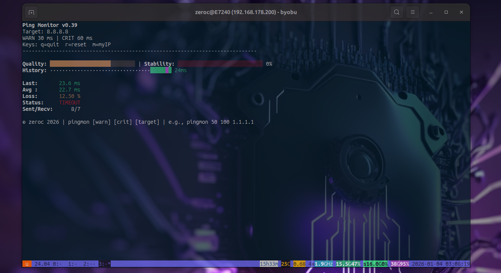
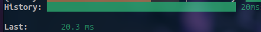

For commercial licensing inquiries, please contact: flyingzeroc@gmail.com

# pingmon - Advanced Ping Monitor


A feature-rich terminal-based ping monitor with real-time statistics, visual history graphs, and network quality analysis.

## 📸 Screenshots

### Normal Operation


### With MyIP Information


### Poor Connection Detection


### History Visualization


## 🚀 Features

### Core Functionality
- **Real-time ICMP latency monitoring** using the system `ping` command.
- **Live terminal UI** with ANSI colors and cursor control.
- **Configurable WARN and CRIT thresholds** for latency visualization.
- **Custom ping target** (IPv4 validated, safe fallback to 8.8.8.8).

### Visual Monitoring
- **Latency history graph** (sliding window, color-coded by WARN/CRIT).
- **Quality indicator** derived from the last latency measurement.
- **Stability indicator** based on packet loss percentage.
- **Dynamic progress bars** for quality and stability.
- **Color-coded metrics** for quick visual assessment.

### Metrics Displayed
- Last latency (ms)
- Average latency (ms)
- Packet loss (%)
- Sent / received packet counters
- Connection status (OK / TIMEOUT)

### Interactive Controls
- `q` – Quit cleanly and restore terminal.
- `r` – Reset statistics and history.
- `m` – Toggle public IP information display.

### Public IP Information (Optional)
- Detects **public IPv4 address**.
- Displays **ISP / organization name**.
- Displays **country/location**.
- Data fetched securely via `curl` / `wget` using `execvp` (no shell execution).
- Queries are cached and fetched only once per session.

### Safety and Robustness
- **No shell execution** (`execvp` only, no `system()` or `popen()`).
- **Graceful signal handling** (SIGINT, SIGTERM, SIGSEGV, SIGPIPE, SIGABRT).
- **Clean terminal restoration** on exit or crash.
- **Non-blocking I/O** for ping output and keyboard input.
- **Timeout detection** when ping responses stop arriving.

### Performance & Design
- Written in **pure C**, no external libraries required.
- Minimal resource usage.
- Designed for **long-running terminal sessions**.
- Works on standard Linux environments.

### Command-line Usage
```bash
pingmon [warn_ms] [crit_ms] [target]

## 🙏 Acknowledgments

- Inspired by various network monitoring tools
- Thanks to the open source community
- ANSI color codes from various terminal standards

---

Made with ❤️ by zeroc | 2026
